# `/v1/*` API 请求全链路时序图

一次推理请求从 TCP 到账本落库的完整路径。参照代码：
[`gw_proxy::kernel::layer`](../crates/gw-proxy/src/kernel.rs) →
[`access`](../crates/gw-proxy/src/access.rs) →
[`hold`](../crates/gw-proxy/src/hold.rs) →
[`routes::dispatch`](../crates/gw-proxy/src/routes.rs) →
[`usage::Settlement`](../crates/gw-proxy/src/usage.rs)。

```mermaid
sequenceDiagram
    autonumber
    actor C as 客户端
    participant MX as metrics::track<br/>(gw-server)
    participant K as kernel::layer<br/>(gw-proxy)
    participant AC as AccessProvider
    participant H as HoldMiddleware
    participant D as routes::dispatch
    participant CH as ChannelPool
    participant P as Provider executor
    participant U as 上游厂商
    participant R as Redis
    participant G as Postgres
    participant S as Settlement<br/>(drain 分离任务)

    Note over C,S: ① 入口 —— 唯一前缀 /v1/，唯一凭据载体 Authorization Bearer
    C->>MX: POST /v1/chat/completions（或 /v1/responses、/v1/messages）
    MX->>MX: 起计时，仅 /v1/* 与 /api/panel/* 计入指标
    MX->>K: next.run(req)
    alt path 不以 /v1/ 开头
        K-->>MX: 放行，不鉴权不计费
    end

    Note over K,G: ② 鉴权（B1 不变量：鉴权先于预扣，顺序写在 kernel::layer 函数体里）
    K->>K: credential_from(headers)
    alt 没有 Bearer
        K-->>C: 401 no_credentials
    end
    K->>AC: authenticate_token(token)
    alt agw- 前缀 —— API Key
        AC->>AC: sha256(明文) 得 key_hash
        AC->>G: api_key_by_hash（L1 ApiKeyCache 未命中才落库）
        AC->>G: touch_api_key 更新 last_used_at（已 detach）
        par 状态 / 订阅 / 倍率 / 并发 四路并行
            AC->>G: users.status 是否 active
        and
            AC->>G: 生效中的 subscription
        and
            AC->>G: group_rate_multiplier
        and
            AC->>G: user_concurrency
        end
    else 其余 —— 面板 JWT
        AC->>AC: validate_jwt HS256（签名、过期、nbf）
        par
            AC->>G: users.status 是否 active
        and
            AC->>G: subscription 与 concurrency
        and
            AC->>G: user_token_versions，过期则拒
        end
    end
    AC-->>K: AccessMetadata(user_id, api_key_id, group_id, rate_mult, subscription, concurrency)
    Note over K: 401 全部在这里返回，此刻还没有任何 Redis 预扣
    K->>H: 挂上扩展后 hold.handle(req, next)

    Note over H,R: ③ 预扣前置 —— 每一道拒绝都排在建立预扣之前
    H->>H: is_billable(method, path)
    alt count_tokens / GET models / GET usage
        H-->>D: 不计费，直接放行到 handler
    end
    H->>H: gw_relay 三面规范 validate（路径 + 方法 + content-type）
    alt content-type 不是 json
        H-->>C: 400 bad_request
    end
    H->>H: 全链路唯一一次 body 解析，得 RequestSpec 与 BillingPeek<br/>(model / stream / max_tokens / 由字节数近似的 input_tokens)
    H->>R: rate_limiter.allow(user, model, group, concurrency)
    alt 超限
        H-->>C: 429 rate_limited
    else Redis 故障
        H->>H: fail-open，只告警
    end
    H->>R: idempotency.check(scoped_key = hash(user + method + path + key))
    alt Redis 故障
        H-->>C: 503 idempotency_unavailable（fail-closed）
    else 命中且在途
        H-->>C: 409 idempotency_conflict
    else 命中且已完成
        H-->>C: 重放缓存响应，不重复计费
    end
    H->>R: circuit_breaker.allow(provider)
    alt 熔断开路
        H-->>C: 503 circuit_open
    end
    H->>G: ledger.has_unresolved_shortfall(user)
    alt 有欠款，或查询本身失败
        H-->>C: 402 outstanding_debt（fail-closed）
    end
    H->>H: compute_reservation 得 hold_amount 与 upper_bound<br/>upper_bound = max(预扣额, 含 max_tokens 的估算, 流式估算)
    opt 该用户有订阅
        H->>G: quota_store.lock_and_rotate（行锁 + 日/周/月计数器轮转）
        alt 配额不足
            H-->>C: 403 quota_exceeded
        end
    end

    Note over H,R: ④ 预扣 —— 一条 Lua 里完成 floor 校验 + ZADD + EXPIRE
    H->>R: ledger.hold_gated(user, hold_amount, upper_bound, request_id, ttl)
    alt 余额兜不住 upper_bound
        R-->>H: INSUFFICIENT_BALANCE 与可用余额
        H-->>C: 402 insufficient_balance，未留下任何预扣
    end
    R-->>H: OK（同 request_id 重入是幂等的）
    H->>H: 生成 SettleCtx / RequestBilling 并挂到请求扩展
    opt 带了幂等键
        H->>R: idempotency.claim(scoped_key)
        alt Redis 故障
            H->>R: ledger.release
            H-->>C: 503 idempotency_unavailable
        else 抢占失败
            H->>R: ledger.release 把刚预扣的钱还回去
            H-->>C: 409，或重放赢家的响应
        end
    end
    H->>D: next.run(req)

    Note over D,U: ⑤ 派发 —— 选上游、选账号、跨账号 failover
    D->>D: inbound() 复用 PeekedBody 与 RequestSpec，不做第二次解析
    D->>D: select_upstreams 四级链<br/>L1 渠道前缀 → L2 模型目录 → L3 别名 → L4 前缀猜测
    alt 没有候选
        D->>S: schedule_release（释放，不结算）
        D-->>C: 404 unknown_model
    end
    opt L1 剥掉了 渠道名/ 前缀
        D->>D: rewrite_model 改写 body 顶层的 model
    end
    D->>D: partition_routable —— 15 格矩阵判直通 / 需转义 / 拒绝
    alt 候选全部落在需转义或拒绝格
        D->>S: schedule_release
        D-->>C: 400 入口方言错误信封（转义器尚未接线）
    end
    loop 最多 MAX_UPSTREAM_ATTEMPTS = 3 个账号
        D->>CH: preferred(user, model) 再 pick_sticky（排除已试过的）
        CH-->>D: AuthRecord（benched 账号已被过滤）
        D->>R: acquire_channel_slot 取渠道并发槽
        alt 槽位已满
            D->>D: 跳过该账号，记 skipped_busy
        end
        D->>P: execute / execute_stream(auth, ProviderRequest)
        P->>P: copy_outbound_headers 剥 hop-by-hop、authorization、x-api-key、x-goog-api-key
        P->>U: HTTPS 请求，凭据由 executor 注入；Accept-Encoding=identity
        alt 上游 5xx / 429 / 传输失败
            U-->>P: 错误
            P-->>D: ProviderError
            D->>CH: record_result(false) 与 circuit_breaker.record(false)
            D->>D: 可重试则换下一个账号
        else 上游 4xx 非 429
            D->>S: schedule_release
            D-->>C: 原样回传错误，不换账号不计费
        end
    end
    alt 三个账号都没成
        D->>S: schedule_release
        D-->>C: 502 / 503（no_upstream 或 channel_busy）
    end

    Note over C,S: ⑥ 回程 —— 响应先走，账本后写
    U-->>P: 2xx
    P-->>D: ProviderResponse / StreamResponse
    D->>CH: record_result(true) + remember(user, model, auth) + 熔断记成功
    alt 非流式
        D->>D: claim_finalize()，每请求恰一次结算权
        D-->>C: 状态码 + 头 + body 原样回传
        D->>S: StreamSettler::drop → drain.spawn(settle)
    else 流式 SSE
        D-->>C: 逐 chunk 转发 Payload
        Note over D: Usage / Error chunk 不进客户端字节流，只留在 settler 上
        alt 上游正常结束或客户端中途断开
            D->>S: StreamSettler::drop → drain.spawn(settle)
        end
    end

    Note over S,G: ⑦ 结算 —— 四种终局，跑在 drain 分离任务里
    S->>S: plan_settlement（usage 有无 / 上游成败 / strict 开关）
    alt 上游失败
        S->>R: ledger.release
        S->>G: usage_logs 记 failed
    else 有 usage 信封（精确）
        S->>S: calc.compute（输入/输出/缓存/推理 四列单价 × rate_mult）
        S->>G: 单事务：settle_tx 扣款 + usage_logs 插入 + 订阅用量累加
        G-->>S: SettleReceipt（shortfall, balance_before, balance_after）
        S->>R: clear_hold，事务提交后才清，清失败则等 TTL
        opt 余额跨阈值
            S->>G: balance_logs 写低余额 / 耗尽事件
        end
    else 无 usage 且 strict 关
        S->>R: active_hold_amount 查预扣额
        S->>G: 按 max(预扣额, 流式估算) 结算，标 billing_fallback
    else 无 usage 且 strict 开，或预扣额查询失败
        S->>G: 只写 usage_logs，不扣不退，预扣走 TTL 自然过期
    end

    Note over MX,G: ⑧ 与单次请求异步的后台补偿
    S->>R: reconcile 扫孤儿预扣，凭 skip_if_already_logged 幂等补结算
    D->>G: auth_records 快照每 5s 重载（单飞闸门）
    D->>G: channel_policies 与模型目录每 60s 刷新
    Note over MX: SIGTERM → 优雅停机 → drain 等尽所有分离结算任务
```

## 退出点与预扣归属

| 退出点 | 状态码 | 预扣 |
| --- | --- | --- |
| 无凭据 / 凭据无效 / 用户非 active | 401 | 未建立 |
| content-type 非 json | 400 | 未建立 |
| 限流、幂等冲突、熔断、欠款、配额 | 429 / 409 / 503 / 402 | 未建立 |
| 幂等 store 故障（check） | 503 `idempotency_unavailable` | 未建立 |
| 余额兜不住 upper_bound | 402 | 未建立（Lua 里 floor 检查失败即拒） |
| 幂等抢占失败或 store 故障（claim） | 409 / 503 | 已建立 → 立即 `release` |
| 未知模型 / 方言不可路由 / 上游全失败 | 404 / 400 / 502 / 503 | 已建立 → `schedule_release` |
| 上游 2xx | 原样 | 已建立 → 分离任务 `settle` |
| 上游 2xx 但无 usage 且 strict 开 | 原样 | 已建立 → **不动**，等 TTL + reconcile |

## 三条不变量

1. **鉴权先于预扣**：写在 `kernel::layer` 的控制流里，不靠两个 `.layer()` 的挂载顺序。
2. **每请求恰一次结算**：`claim_finalize()` 是唯一票据，四个入口（流式 / 一元 / release / hold 兜底）抢同一张，所以跨账号 failover 不会重复计费。
3. **账本写入不挡响应**：`StreamSettler::drop` 把结算 spawn 到 `ProxyState::drain`，停机时由 `gw_server::drain` 等尽 —— 用裸 `tokio::spawn` 会在 runtime 落地时静默丢单。

## 对抗审查勘误（对照当前代码）

时序图是意图说明书，不是 wire 契约。下面是图与 `gw-proxy` 热路径仍不一致的部分。

| 图上的话 | 代码 |
| --- | --- |
| JWT「只校验签名与过期」 | 现已与面板同一套 `token_version` 吊销；查失败 fail-closed。 |
| 未知模型 **404** | **400** `unsupported model`。 |
| 渠道忙 **503**；配额超限 **403** | 渠道忙 **429**；配额 **402** `Payment Required`。 |
| `error: no_credentials / rate_limited / circuit_open` | 多数是 HTTP 状态短语（`missing credentials`、`Too Many Requests`、`Service Unavailable`）。 |
| 四级链 L1→L4 已上线 | 生产 **未** `with_channel_resolver`，只走 L4 前缀猜测。 |
| OAuth 过期先 refresh | `execute` **不**调 `Provider::refresh`，旋转结果也不 `auth_store.save`。 |
| auth_records 每 5s ticker | 5s TTL **懒加载**，`refresh_auths` 无调用方。 |
| 三个账号都没成 → 502/503 | `NoUpstream` 是 503，`ChannelBusy` 是 429。 |

未改的结构性缺口：生产未开四级链；热路径不 refresh OAuth。
