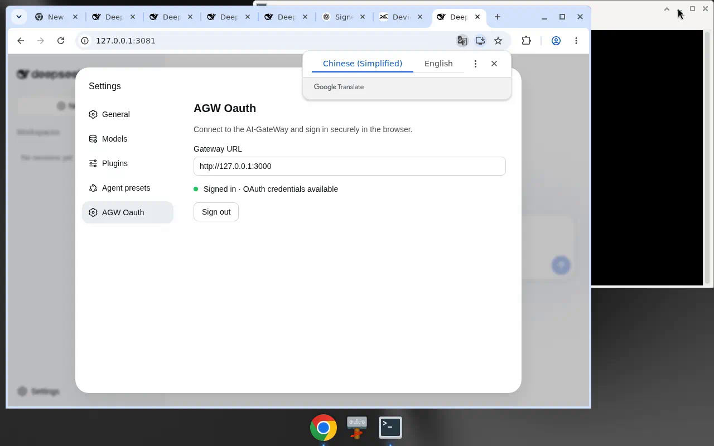

# AGW-Oauth

DeepSeek Harness plugin: OAuth into **AI-GateWay** and use its `/v1` models without writing a model config file.

## Install

From this repository checkout:

```bash
dsh plugin --profile web add ./plugins/agw-oauth
```

From GitHub (allow the package `prepare` script so `src/` builds to `lib/`):

```bash
dsh plugin --profile web add github:xxww0098/ai-gateway
```

The plugin path inside the repo is `plugins/agw-oauth` (`dsh-agw-oauth`).

## Settings UI

On the web profile, open **Settings → AGW Oauth**. Enter the gateway URL, then **Sign in**. The page starts the existing device-code flow and polls until the OAuth credential is stored. No new OAuth protocol.



`/agw login`, `/agw status`, and `/agw logout` keep working in the command bar.

## Environment

| Variable | Meaning |
| --- | --- |
| `AGW_ORIGIN` | AI-GateWay origin, e.g. `https://gw.example.com`. Optional if the URL is saved in Settings → AGW Oauth. |

After OAuth the origin and API key are stored under `$DSH_HOME/agw-oauth.json` (default `~/.dsh/agw-oauth.json`). The settings field can persist origin alone (not logged in until an API key is also present).

## Login

1. Set the gateway URL in **Settings → AGW Oauth** (or `AGW_ORIGIN`) and start Harness (`dsh web` or the CLI).
2. Click **Sign in**, or run `/agw login`. Either returns as soon as a verification URL and user code exist.
3. Open the URL, sign into the existing AI-GateWay panel, and approve.
4. The plugin polls, receives an `agw-` API key plus the gateway origin, then `GET {origin}/v1/models`.
5. Models appear on the `ai-gateway` provider route. `resolveModel()` exposes catalog thinking efforts, `text`/`image` modalities, and input/output token limits — only what the catalog listed.

`/agw status` and `/agw logout` are also available.

## Gateway routes

The plugin talks to:

- `POST /api/panel/oauth/dsh/device/code`
- `POST /api/panel/oauth/dsh/device/token`
- `GET /oauth/dsh` (browser consent; existing panel login)
- `POST /api/panel/oauth/dsh/device/approve` (authenticated)
- `GET {origin}/v1/models` and `POST {origin}/v1/chat/completions`

## 中文

见 [README.zh.md](./README.zh.md)。

## Optional HTTP API

When the web profile is running, the plugin also exposes same-origin:

- `POST /agw-oauth/login/start` — same as `/agw login`; returns URL and user code immediately
- `GET /agw-oauth/status` — `{ loggedIn, origin, watch }` (origin is returned even when only the settings field was saved)
- `POST /agw-oauth/origin` — `{ "origin": "https://..." }` persist origin without `AGW_ORIGIN`
- `POST /agw-oauth/logout` — same as `/agw logout` (clear store, drop adapter)
